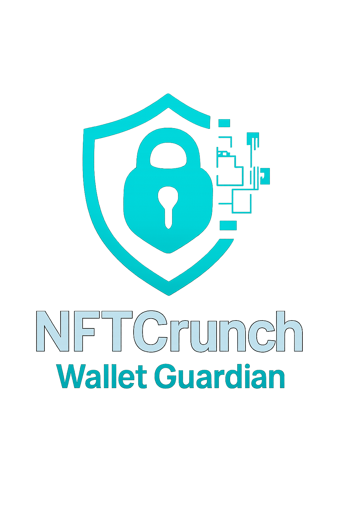

# 🛡️ NFTCrunch - Wallet Guardian Bot @NFTCrunch_bot


**An AI-powered security analyst for Telegram, built for the [bitsCrunch x AI Builders Hack 2025](https://dorahacks.io/hackathon/crunchhack2025/detail).**

[](https://dorahacks.io/hackathon/crunchhack2025/detail)
[](https://www.python.org/)
[](https://opensource.org/licenses/MIT)

---

### 🎥 Live Demo

<p align="center">
  
</p>

<p align="center">
  <a href="https://x.com/ayush17_08/status/1952353647750418452" title="Click to watch the demo video">
    
  </a>
</p>

[X/Twitter-Post](https://x.com/ayush17_08/status/1952353647750418452)
---

## 💡 The Problem

The Web3 and NFT space is dynamic and exciting, but it's also fraught with risks, including sanctioned wallets, wash trading, and other illicit activities. For retail users, traders, and even developers, assessing the risk profile of a wallet address is a complex and time-consuming task. There is a clear need for a tool that can provide instant, easy-to-understand security insights without requiring deep forensic knowledge.

## 🚀 The Solution

**NFTCrunch - Wallet Guardian** is an intelligent Telegram bot that solves this problem. It acts as a personal security analyst, available 24/7. By simply providing an Ethereum wallet address, any user can receive a concise, AI-generated risk report in seconds.

The bot leverages the powerful, detailed data from the **bitsCrunch API** and the analytical capabilities of **Google's Gemini LLM** to deliver a report that is both comprehensive and incredibly easy to digest.

---

## ✨ Key Features

*   **🤖 AI-Powered Risk Reports:** Instead of just showing raw data, the bot uses an LLM to generate a human-readable summary, including an "Overall Risk Verdict" and six analytical key findings.
*   **🚨 Instant Sanction Screening:** Immediately identifies if a wallet is on a sanctions list, providing a critical, high-priority warning.
*   **🔎 AML Risk Analysis:** Reports the Anti-Money Laundering (AML) risk level associated with the wallet.
*   **🧐 Holder Profile Insights:** Determines if the wallet belongs to a notable holder class, such as a "Whale" or "Shark."
*   **🌊 Wash Trading Detection:** Analyzes and reports on potential wash trading activity associated with the wallet's NFTs.
*   **資産 Asset Overview:** Provides a high-level summary of the wallet's NFT and token holdings, highlighting asset concentration.
*   **💬 User-Friendly Interface:** A simple, conversational interface on Telegram. Users can either use the `/check_wallet` command or just paste an address to start an analysis.

---

## 🛠️ Tech Stack & Architecture

*   **Backend:** Python 3
*   **Bot Framework:** `python-telegram-bot`
*   **Blockchain Data:** **bitsCrunch API V2**
*   **AI & Language Model:** **Google Gemini API** (`gemini-2.5-flash`)
*   **Configuration:** `python-dotenv` for secure management of API keys.

### 🔌 bitsCrunch API Endpoints Used

This project relies heavily on the rich data provided by the bitsCrunch API. The following endpoints were crucial for the analysis:

*   `GET /nft/wallet/profile`: To retrieve holder classifications, sanction status, AML risk, and asset counts.
*   `GET /nft/wallet/scores`: To gather performance metrics like realized profit and portfolio value.
*   `GET /nft/wallet/washtrade`: To detect wash trading patterns.
*   `GET /wallet/balance/nft`: For a brief overview of NFT holdings.
*   `GET /wallet/balance/token`: For a brief overview of ERC-20 token holdings.

---

## ⚙️ Setup and Running Locally

Follow these steps to run your own instance of the Wallet Guardian bot.

### Prerequisites

*   Python 3.8+
*   Git
*   A Telegram account

### 1. Clone the Repository

```bash
git clone https://github.com/ayush002jha/NFTCrunch.git
cd NFTCrunch
```

### 2. Create a Virtual Environment

It's highly recommended to use a virtual environment to manage dependencies.

```bash
python -m venv env
source env/bin/activate  # On Windows, use `env\Scripts\activate`
```

### 3. Install Dependencies

```bash
pip install -r requirements.txt
```

### 4. Set Up Environment Variables

The bot requires three secret keys to function.

Create a file named `.env` in the root of the project directory. Copy the contents of `.env.example` or use the template below.

```.env
# .env file

# Get this from @BotFather on Telegram
TELEGRAM_BOT_TOKEN="YOUR_TELEGRAM_BOT_TOKEN_HERE"

# Get this from UnleashNFTs.com after signing in
BITSCRUNCH_API_KEY="YOUR_BITSCRUNCH_API_KEY_HERE"

# Get this from Google AI for Developers
GOOGLE_AI_API_KEY="YOUR_GOOGLE_AI_API_KEY_HERE"
```

### 5. Run the Bot

Once the dependencies are installed and your `.env` file is configured, start the bot with:

```bash
python bot.py
```

The bot is now running and will poll for new messages on Telegram.

---

## 🤖 How to Use the Bot

1.  **Find the Bot on Telegram:** Search for "NFTCrunch - Wallet Guardian" (@NFTCrunch_bot).
2.  **Start the Chat:** Press the "Start" button or send the `/start` command.
3.  **Analyze a Wallet:** There are two easy ways:
    *   **Directly paste a wallet address** into the chat and send.
    *   Use the command: `/check_wallet 0xAb5801a7D398351b8bE11C439e05C5B3259aeC9B`

The bot will provide its comprehensive risk report within seconds.

---

## 📜 License

This project is licensed under the MIT License. 

## 🙏 Acknowledgments

*   Thank you to **bitsCrunch** and **DoraHacks** for organizing this incredible hackathon and providing the powerful tools to make this project possible.
*   The **Google Gemini** team for their highly capable and easy-to-use LLM API.
*   The developers of the `python-telegram-bot` library.
